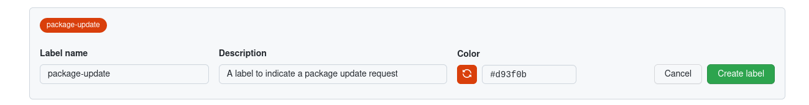

# Spack Updater

The spack updater is intended to target a local package.py recipe of interest,
and compare it for differences with upstream spack.

1. If the files differ and the upstream is changed more recent, a PR is done to the branch here for it.
2. If the files differ and the local change is more recent, a PR is done to spack. See below for how this is done.
3. The same is applied for changes to associates files in the package directory.

We can also detect the cases where a package is newly added to spack or the repository.
However, since we cannot tell if absence / addition of a supplementary file means
it was actually added locally or deleted upstream, we instead take a more conservative
approach to just look for changes in the files. E.g., any deletion/addition of a supplementary
file usually means an update to the package.py.

### How do we update to spack?

We can't do a pull request to a different repository programatically without a
personal access token, which @vsoch doesn't like to provide, even scoped.

Thus, the way we are going to do the pull request is a bit of a trick, and manually done.
The workflow will be intended to be run on a merge to a main branch, and when it detects
changes, it will open an issue on itself (we cannot open issues on other repos)
that will provide a link for a human to open the issue, and opening the issue
on the subsequent repository will trigger the building workflow.

Given that the pull request trigger detects a changed workflow, we comment
back to the pull request a link to open a pull request to the upstream that will
trigger a workflow there to do the update.

TLDR: This should ensure that local changes to a package.py file and associated assets
are generally synced. It's recommended to do this in unision with ensuring the package
still builds. This can be done with the [pakages spack builder](https://syspack.github.io/pakages/).

**under development**

## Usage

### GitHub Actions

We recommend that you add a `package-update` label to your repository running the action,
mostly for organizational purposes.



You then typically want to run this on a merge to a main branch, and after you've determined
that the recipe builds and is good to update to the upstream.

```yaml
name: Update Spack
on:
  push:
    branches:
     - main

  jobs:
    test-action:
      name: Test Action Update
      runs-on: ubuntu-latest
      steps:
        - name: Checkout Repository
          uses: actions/checkout@v3

        - name: Spack Update
          uses: sciworks/spack-updater@main
          with:
            token: ${{ secrets.GITHUB_TOKEN }}
            repo: .
            package: zlib
            upstream: https://github.com/vsoch/spack
            branch: develop
            pull_request: true
```

In the above, asking for the pull_request will actually open an issue with
a link for you to click to start the process.

### Testing

To test with the example package here (zlib) you can do:

```bash
$ python update_package.py zlib
```

which is equivalent to:

```
$ python update_package.py --repo . zlib
```
